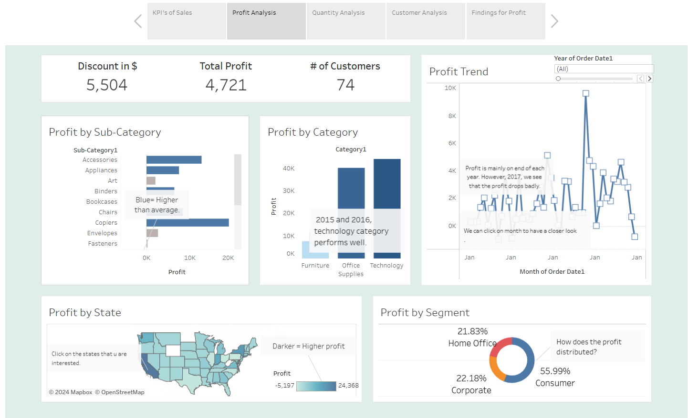

# Superstore Sales Data Analysis Dashboard

This Tableau dashboard analyzes sales, profit, and customer behavior trends using the **Sample Superstore** dataset. The dashboard provides insights into different segments of the store, including:

- **Sales and Profit Trends** across regions and product categories.
- **Detailed Segments** by sales and profit.
- **Customer Segments** and their purchasing behavior.
- **Geographical Insights** into performance by state and city.

## Interactive Dashboard

You can explore the full interactive dashboard on [Tableau Public](https://public.tableau.com/views/ABAV1_17279338119310/VisualizationofSuperstore?:language=en-US&publish=yes&:sid=&:redirect=auth&:display_count=n&:origin=viz_share_link).

### Key Features:
- **Sales Performance**: Visualizes sales and profit trends over time and different regions.
- **Product Categories**: Breaks down performance by category and sub-category.
- **Regional Insights**: Includes a map showing sales and profit by region and state.
- **Customer Analysis**: Analyzes the customer that repeat purchase, and visualized the customer cohort.

### Dataset
The analysis is based on the **Sample Superstore** dataset, a common dataset for retail sales analysis in Tableau.

### How to Use:
- Explore the dashboard by interacting with filters for **regions**, **categories**, and **dates**.
- Hover over data points for more detailed insights on sales and profit figures.

### Visualizations:
Here are some screenshots of the key visualizations included in the dashboard:

()

---

## How to Replicate:
To replicate this analysis, download the Tableau workbook (.twbx) or access the project on [Tableau Public](https://public.tableau.com/views/YourDashboard).

Link to the dataset: [Kaggle](https://www.kaggle.com/datasets/vivek468/superstore-dataset-final?select=Sample+-+Superstore.csv ).
